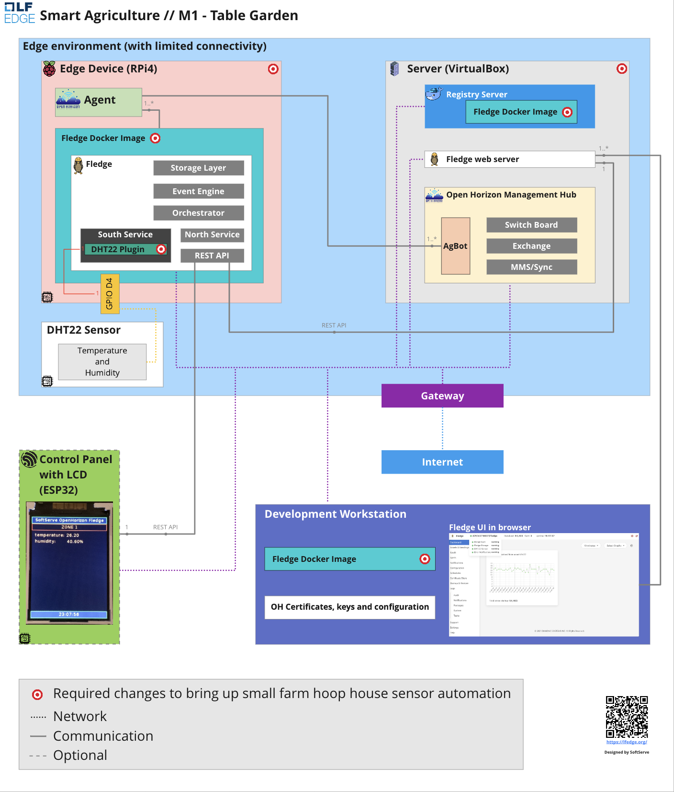
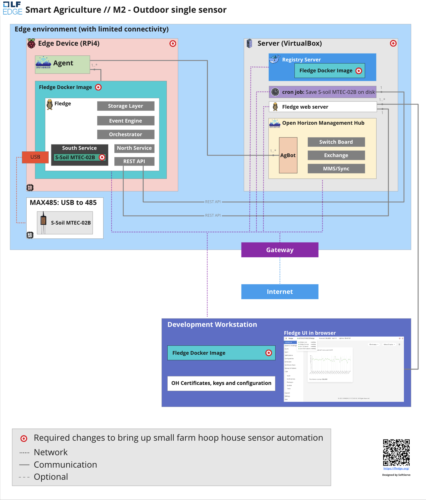

# Overview
Open Horizon Smart Agriculture SIG

Core Beliefs
- For farmers with no technical background the solution provides interprise level security, step by step guides how to setup and start gathering digital data from supported sensors to control growth of healthy crops.
- With sufficient sensors and data, you should be able to apply the optimum resources to grow crops to their maximum yield.
- You should not need chemical fertilizers and pest control to grow healthy crops (whenever possible)
- Potential harm to crops can be caught earlier, and with less impact to yield, through intensive imaging and analytics (24hr farming).
- You can prevent harm to, and improve the well-being of, livestock with fewer manual interventions through judicious monitoring and analytics.
- Local analytics can respond more quickly, and with less expense, than cloud-based analytics, especially in areas with little to no internet connectivity.

# Milestone 1 (Table Garden)
- Prepare easy-to-follow steps to deploy on both dev environment and in the field.
- Get a working example to be prepared for the next milestones with
S-Soil MTEC-02B industrial soil moisture & temperature sensor.
- Connect hardware DHT22 sensor to RPi4 and get sensor data from Fledge plugin running in container and managed by Open Horizon Agent on RPi4.
- Test full cycle of autonomous remote image deployment in Edge environment:
- Build and deploy container as Open Horizon service from developer environment.
- Install by OpenHorizon Agent a newly updated service container.
- Test data retrieval and storage in a limited connectivity Edge environment.

[How to setup Milestone 1](docs/Milestone_1.md)

# Milestone 2 (Outdoor single sensor)
...Insert image here
- Connect **S-Soil MTEC-02B** and get data 
- Add south plugin for **S-Soil MTEC-02B**
- Store all **S-Soil MTEC-02B** data in persistent storage on local drive.
- Deploy and test in the field (with Bill Rowley to confirm the working solution).

[How to setup Milestone 2](docs/Milestone_2.md)

# Milestone 3 (Cloud integration with Zero-trust security)
...Insert image here
- Add capability to securely access an Internet connected Node Edge device from development workstation.
- Add Cloud server with pre installed management hub, etc. 
- Add security requirements for PROD.
- Add Graphina support for Dashboard
- Add option to use only cloud without local edge server

# Milestone 4 (Private LoRaWAN Edge Network)
...Insert image here
